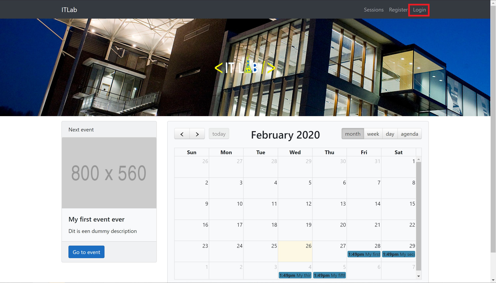
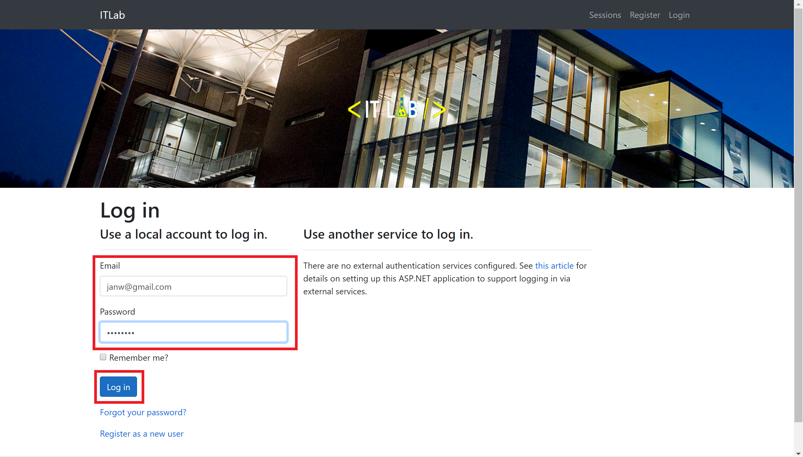
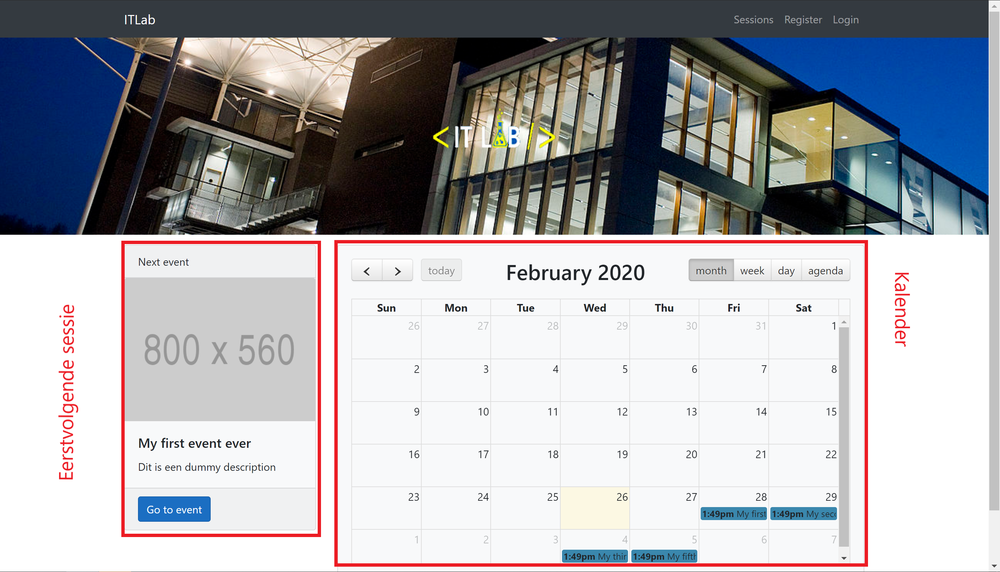
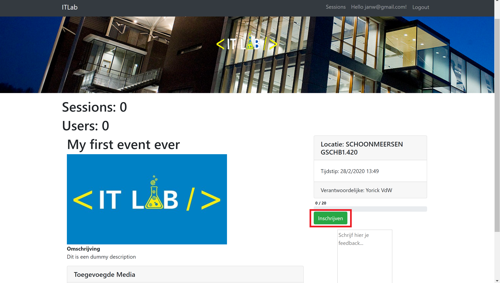
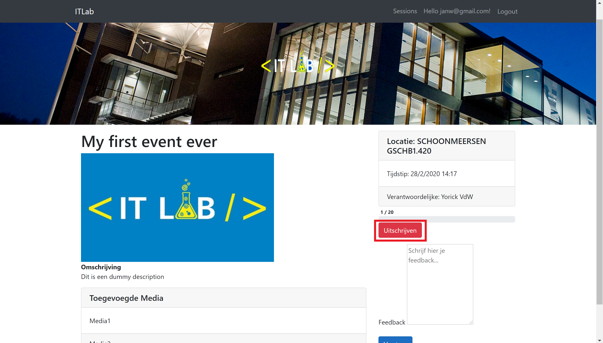
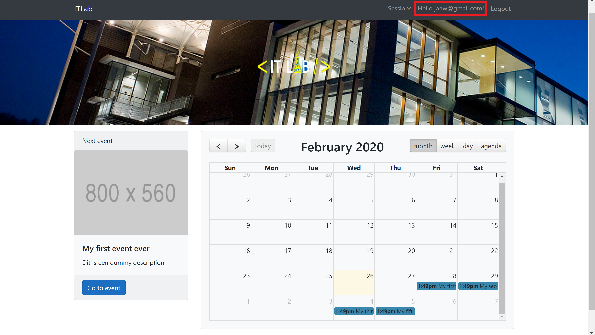
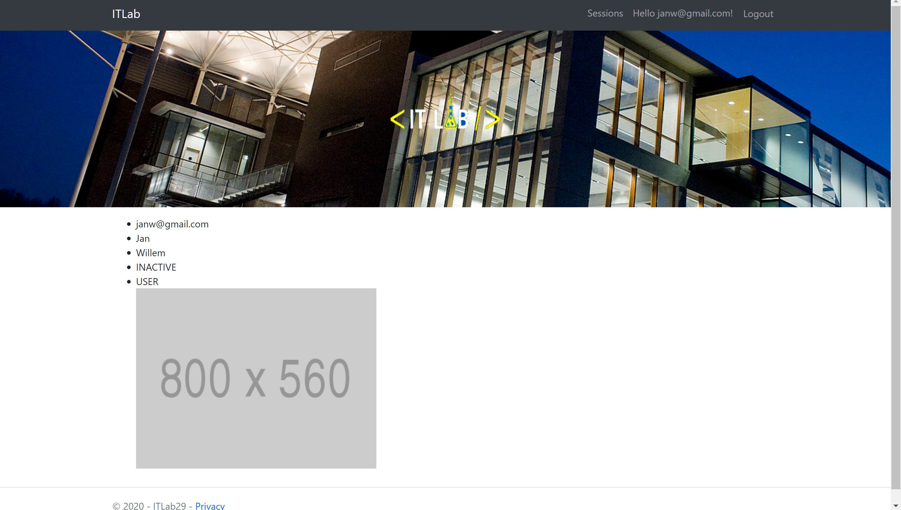

# dotnet-g029
Projecten 2: Programmeren door:
* Jordy Van Kerkvoorde
* Jan Willem 
* Sander Castanheira Machado
* Yorick Van de Woestyne

### Vragenlijst .NET
https://docs.google.com/document/d/1nHahe-rHXzC9qHJKZP31QGMkAKhOFeiZEcpY7UWPW8M/edit?usp=sharing

## Sprint 1

### Functionaliteiten

* Aanmelden
* Lijst sessies weergeven (Kalender)
* Sessie in detail weergeven
* Inschrijven en uitschrijven voor sessie
* User pagina

### Flow

Hieronder bespreken we de volgende functionaliteiten van de applicatie. Aan de hand van screenshots kan de flow gevolgd worden om de verschillende functionaliteiten te gebruiken.

#### Aanmelden
Je start op de home pagina van de applicatie en klik op "Login" rechtsbovenaan de pagina.  

Op deze pagina vul je een geregistreerde gebruikersnaam en bijhorden wachtwoord in en druk op "Log in".  
 
  
Indien juiste gebruikersnaam en wachtwoord ben je nu succesvol ingelogd en zie je vanboven een welkomstbericht met je gebruikersnaam.  

#### Lijst sessies weergeven
Je ziet de eerstvolgende sessie links op de home pagina en rechts ziet u de kalender met alle sessies.

#### Sessie in detail weergeven
Een sessie in detail weergeven kan op 2 manieren. Ofwel neem je de eerstvolgende sessie die links op de home pagina staat ofwel selecteer je een sessie uit de kalender (rechts).

#### Inschrijven en uitschrijven voor sessie
Om voor een sessie in te schrijven selecteer je een sessie in detail en klik je op inschrijven/uitschrijven. Je kan enkel inschrijven indien er nog beschikbare plaatsen zijn en ingelogd bent.

Inschrijven  

Uitschrijven  

#### User pagina
Wanneer je aangemeld bent kun je naar uw persoonlijke User pagina gaan. Dit doe je door bovenaan op je gebruikersnaamm te klikken.

Vervolgens zie je jouw User pagina.

